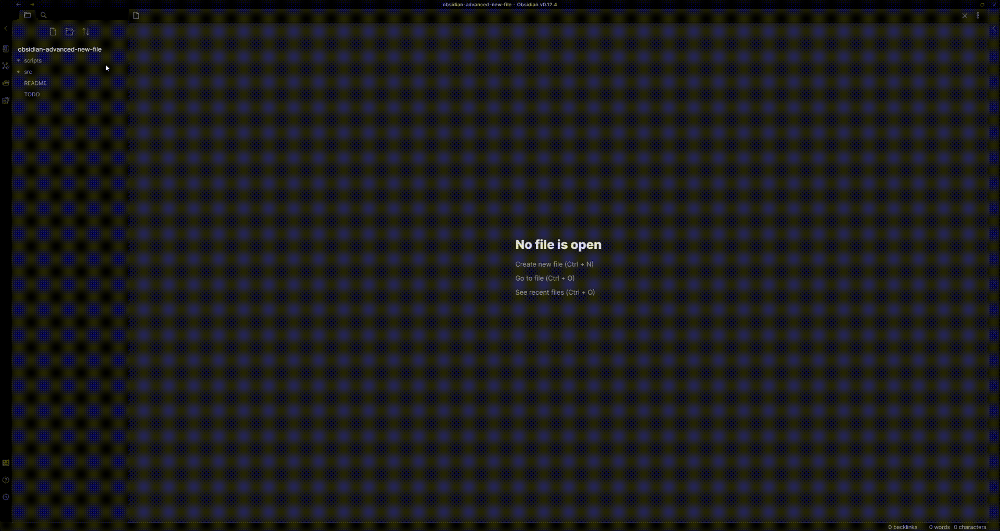

## Obsidian Advanced New File

Obsidian Advanced New file is a plugin for [Obsidian](https://obsidian.md/), that provide functionality to choose folder over note creation.
The new note file is created with `Untitled.md` filename just to provide same behavior as default Obsidian.

The plugin is heavily inspired by [Note refactor](https://github.com/lynchjames/note-refactor-obsidian) amd [similar extension](https://marketplace.visualstudio.com/items?itemName=dkundel.vscode-new-file) for Vs Code.

## Feature

**Hint:** you can set command `advanced new file` to shortcut like `Ctrl/Cmd` + `Alt` + `N`.

Spawn command `advanced new file` and choose directory.

### How to develop

- Clone this repo.
- `npm i` or `yarn` to install dependencies
- `npm run dev` to start compilation in watch mode.

### Manually installing the plugin

- Copy over `main.js`, `styles.css`, `manifest.json` to your vault `VaultFolder/.obsidian/plugins/your-plugin-id/`.
